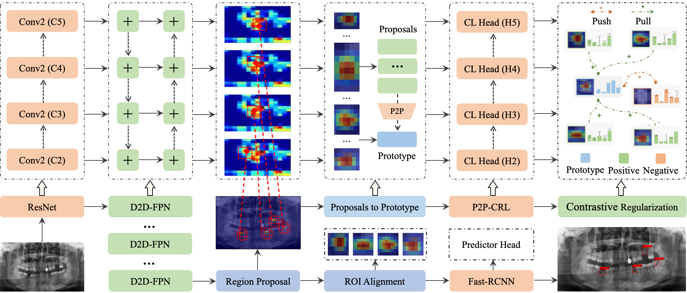

# CariesXrays: Enhancing Caries Detection in Hospital-scale Panoramic Dental X-rays via Feature Pyramid Contrastive Learning





### Abstract:

Dental caries has been widely recognized as one of the most prevalent chronic diseases in the field of public health. Despite advancements in automated diagnosis across various medical domains, it remains a substantial challenge for dental caries detection due to its inherent variability and intricacies. To bridge this gap, we release a hospital-scale panoramic dental X-ray benchmark, namely “CariesXrays”, to facilitate the advancements in high-precision computer-aided diagnosis for dental caries. It comprises 6,000 panoramic dental X-ray images, with a total of 13,783 instances of dental caries, all meticulously annotated by dental professionals. In this paper, we propose a novel Feature Pyramid Contrastive Learning (FPCL) framework, that jointly incorporates feature pyramid learning and contrastive learning within a unified diagnostic paradigm for automated dental caries detection. Specifically, a robust dual-directional feature pyramid network (D2D-FPN) is designed to adaptively capture rich and informative contextual information from multi-level feature maps, thus enhancing the generalization ability of caries detection across different scales. Furthermore, our model is augmented with an effective proposals-prototype contrastive regularization learning (P2P-CRL) mechanism, which can flexibly bridge the semantic gaps among diverse dental caries with varying appearances, resulting in high-quality dental caries proposals. Extensive experiments on our newly-established CariesXrays benchmark demonstrate the potential of FPCL to make a significant social impact on caries diagnosis.

### Requirements:
* Python3.6/3.7/3.8
* Pytorch1.7.1
* pycocotools(Linux:`pip install pycocotools`; Windows:`pip install pycocotools-windows`)
* Ubuntu or Centos
* detail in `requirements.txt`


### Download test models to weight:
```
https://drive.google.com/file/d/1bHaUjqPWrL-OXM2-IPl5gBBgTs0TfULT/view?usp=drive_link
```

### Download CariesXrays_Dataset:

```
Our newly-established CariesXrays dataset is made publicly available at：https://drive.google.com/drive/folders/1qWL2f0A-vf91StHxs24eoiFDyuoHEh4N?usp=drive_link
```

### Running the code on CariesXrays (VOC-style):
* CariesXrays dataset will follow this item at upload
* FPCL Training：python train.py

### Please consider citing the following paper if you find this work useful for your research.

```
@inproceedings{chen2024fpcl,
  title={CariesXrays: Enhancing Caries Detection in Hospital-scale Panoramic Dental X-rays via Feature Pyramid Contrastive Learning},
  author={Chen, Bingzhi and Fu, Sisi and Liu, Yishu and  Pan, Jiahui and Lu, Guangming and Darrenzz },
  booktitle={Proceedings of the AAAI Conference on Artificial Intelligence (AAAI)},
  pages={xxx--xxx},
  year={2024},
  organization={AAAI Press}
}
```
If you have any questions, please contact us: chenbingzhi@m.scnu.edu.cn, or darrenzz219@gmail.com.


